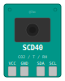

# Wokwi SCD40 CO2 Sensor Chip

<p align="center">
  
</p>

Sensirion SCD40 photoacoustic CO2/Temperature/Humidity sensor simulation for the [Wokwi](https://wokwi.com) simulator.

## Usage

Add to your Wokwi project's `diagram.json`:

```json
{
  "type": "chip-scd40",
  "id": "co2",
  "attrs": { "co2": "800", "temperature": "25", "humidity": "50" }
}
```

Reference in `wokwi.toml`:

```toml
[[chip]]
name = "SCD40"
binary = "chips/scd40.chip.wasm"
```

Or use the GitHub release directly:

```
"github:7ax/wokwi-chip-scd40@2.0.0"
```

## Supported Commands (20/20)

All 20 SCD4x datasheet commands are implemented with correct protocol behavior, state validation, and execution times.

| # | Command | Hex | Payload | Response | Exec ms | State |
|---|---------|-----|---------|----------|---------|-------|
| 1 | start_periodic_measurement | `0x21B1` | - | - | - | idle only |
| 2 | read_measurement | `0xEC05` | - | 9 bytes | 1 | meas only |
| 3 | stop_periodic_measurement | `0x3F86` | - | - | 500 | meas only |
| 4 | get_serial_number | `0x3682` | - | 9 bytes | 1 | idle only |
| 5 | get_data_ready_status | `0xE4B8` | - | 3 bytes | 1 | any |
| 6 | set_temperature_offset | `0x241D` | 3 bytes | - | 1 | idle only |
| 7 | get_temperature_offset | `0x2318` | - | 3 bytes | 1 | idle only |
| 8 | set_sensor_altitude | `0x2427` | 3 bytes | - | 1 | idle only |
| 9 | get_sensor_altitude | `0x2322` | - | 3 bytes | 1 | idle only |
| 10 | set_ambient_pressure | `0xE000` | 3 bytes | - | 1 | any* |
| 11 | perform_forced_recalibration | `0x362F` | 3 bytes | 3 bytes | 400 | idle only |
| 12 | set_automatic_self_calibration | `0x2416` | 3 bytes | - | 1 | idle only |
| 13 | get_automatic_self_calibration | `0x2313` | - | 3 bytes | 1 | idle only |
| 14 | start_low_power_periodic | `0x21AC` | - | - | - | idle only |
| 15 | persist_settings | `0x3615` | - | - | 800 | idle only |
| 16 | perform_self_test | `0x3639` | - | 3 bytes | 10000 | idle only |
| 17 | perform_factory_reset | `0x3632` | - | - | 1200 | idle only |
| 18 | reinit | `0x3646` | - | - | 30 | idle only |
| 19 | power_down | `0x36E0` | - | - | 1 | idle only |
| 20 | wake_up | `0x36F6` | - | - | 30 | sleep only |

*set_ambient_pressure is the only calibration command allowed during measurement.

I2C address: **0x62** (fixed)

## Interactive Controls

| Control     | Range        | Default |
|-------------|--------------|---------|
| CO2 (ppm)   | 400 - 5000   | 800     |
| Temp (C)    | -10.0 - 60.0 | 25.0    |
| Humidity (%RH) | 0 - 100   | 50      |

## Protocol

The SCD40 uses a **command-based** I2C protocol (not register-based). The master sends a 16-bit command word (MSB first), then reads the response in a separate I2C transaction.

Payload commands send 5 bytes: command(2) + data(2) + CRC(1). Payloads with invalid CRC are silently ignored (matches real hardware).

All response data uses Sensirion's CRC8 (polynomial 0x31, init 0xFF) after every 2-byte word.

Commands are state-validated: idle-only commands are ignored during measurement, and all commands except wake_up are ignored when powered down. The device NACKs its I2C address during command execution busy periods.

Compatible with the [Sensirion SCD4x Arduino library](https://github.com/Sensirion/arduino-i2c-scd4x).

## Simulation Limitations

1. **Calibration values stored but don't affect readings** — interactive controls represent final output values. The real chip applies proprietary compensation algorithms; any approximation risks creating simulation/hardware divergence.
2. **Power-down ACKs address** — the real chip NACKs its I2C address when powered down. This simulation accepts writes but ignores all commands except wake_up. Firmware that checks for NACK to detect power state will behave differently.
3. **No sensor noise/drift** — readings are deterministic from interactive controls.
4. **FRC always returns correction=0** — the simulated sensor is perfectly calibrated.
5. **Self-test always passes** — no hardware to malfunction.

## Building

### GitHub Actions

Push a tag starting with `v` (e.g., `v2.0.0`) to create a release with the compiled WASM binary.

### Local (Docker)

```bash
docker run --rm -v ${PWD}:/src wokwi/builder-clang-wasm:latest make
```

### Local (with WASI SDK)

```bash
make
```

Requires `clang` with WASI sysroot at `/opt/wasi-libc`.

## License

MIT
